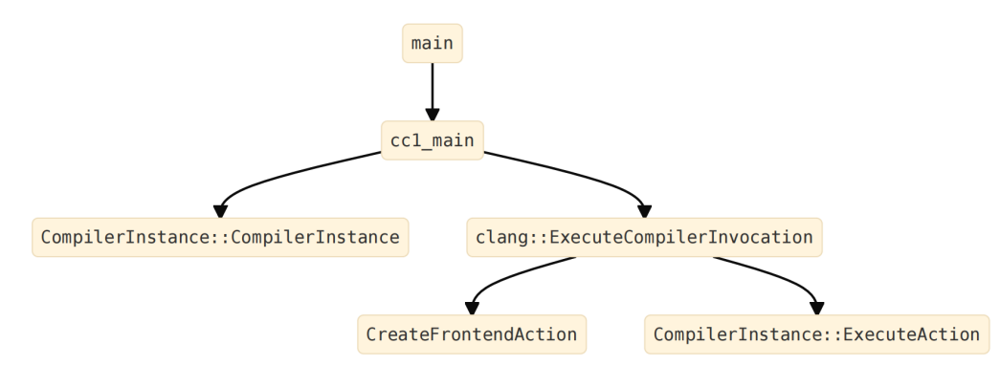
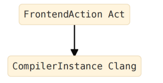
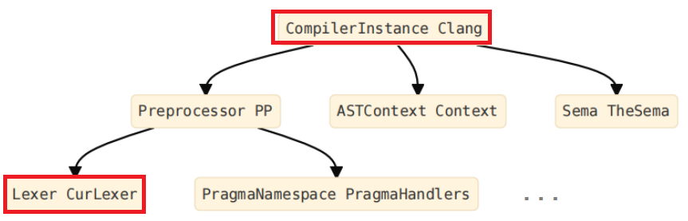
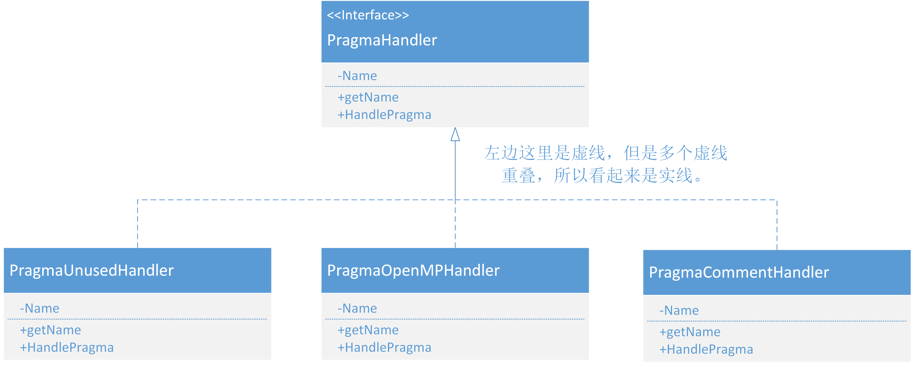

## 源码分析作业（期末汇总）

###### 学号：2020K8009926004

#### 声明：这一文档将被提交到一个公开仓库，出于隐私考虑，报告中不提及姓名。如有任何问题，欢迎和我邮件或QQ联系。

选题：LLVM中Clang部分的Scanner功能，该模块代码行数超过50k，主要使用的语言是C++，采用的是面向对象的程序设计。

选题原因：这学期选了编译原理课。希望把两门课的内容进行更好的结合。

### 第一部分：功能和建模

#### 1. 主要功能、流程、模块

##### 1.1 LLVM

LLVM是一个开源的编译器基础设施项目，也是一个编译器和工具链技术的集合，其特点为模块化、可重用。可以用来开发任何编程语言的前端和任何指令集架构的后端。LLVM的设计中，为了达到模块化，它的核心实现是基于语言无关的中间表示（IR，一种可移植的高级汇编语言），这样，就可以通过多次遍历进行各种优化，而与更高级层面的高级语言以及更低级层面的机器架构都无关，从而让编译的大部分过程通用、可重用。

和很多其他编译器类似，LLVM的主要功能包括：

1. **进行语法检查**：LLVM可以进行语法检查，对于输入它的高级语言代码，检查不符合该语言语法规范的情况并视情况报出Warning或者Error。这样，一方面，程序员可以及时发现自己所编写的代码中存在的错误并加以改正；另一方面，也避免存在语法错误的代码进入后续的流程，导致编译器出错。
2. **编译高级代码为二进制**：这也是整个LLVM Pipeline的最重要的功能，也是编译器的最重要、最核心、最本质的功能。这一功能输入源代码，输出目标二进制代码。在所有相关功能中，编译高级代码为二进制，是从头到尾走完整个pipeline的。这也是编译器的意义之所在。
3. **对代码进行优化**：编译器会对代码进行优化。对于大多数代码，存在一些通用的优化方式，例如控制流简化、将复杂对象替换为标量、消除重复计算、优化全局变量、常量传播、死代码消除、循环优化、内联展开、指针分析等等。这些优化方式是在中间表示（IR）层面进行优化的，与具体指令集无关。而另有一些优化方式，它们对于具体的指令集是强相关的，例如RISC-V上的压缩指令集。

LLVM的主要流程如下：


其中，可以看到，LLVM的主要流程分为三段。第一段是前端，之后是中端和后端。

LLVM的前端负责生成抽象语法树（Abstract Syntax Tree, AST），并将之转换为原始的LLVM IR中间表示；中端负责将前端所输出的原始LLVM IR进行通用的优化，也即前面提到的在中间表示层面优化，并输出优化后的LLVM IR；而后端则负责输出转为机器指令后的原始代码。在一部分定义下，后端输出的是汇编代码，需要汇编器和链接器负责将它们转为目标二进制代码。但同样也有很多定义之下，汇编器和链接器也算在后端之中。下文中，为方便起见，采用后一种定义。

##### 1.2 Clang

Clang是LLVM项目中的一个原生前端模块。它支持的源语言（高级语言）包括C、Objective-C、C++。

Clang最早是由Apple资助开发的，用于开发一个更为通用的、在其自行开发的OS下表现更好的GNU编译器套装的替代品。这是因为Apple和GCC在当时存在分歧：Apple对Objective-C的自定义扩展得不到GCC的支持，且GCC的模块化程度太低，导致在只调用其中的少数模块时，十分不便。而GCC作为开源项目，也有着自己的苦衷。

因而，Apple资助开发了Clang。Clang在配合LLVM的情况下，相比GCC在编译C、Objective-C及C++的情况下，有着性能和功能上的巨大提升。一方面，它的编译用时降低到了GCC的不到50%，内存使用降低了近90%，且显示的错误诊断信息更为详细。

和其他的编译器前端十分类似，它可以进行语法错误检测，也可以完成整个前端工作，输出中间表示。

作为一个编译器前端，它也同样有着类似的流程，主要模块如下：


事实上，其中的每个模块，其内部结构都十分复杂，可以继续细分。但是，我们在此处不必把这些细分的结果写出来。

其中可以看到，Preprocessor负责处理预处理器指令，包括宏定义`#define`、条件编译`#ifdef`、导入头文件`#include`等。

Lexer则负责，和Preprocessor一道，把源代码转换为Token Stream。它们组成的是编译原理中的扫描器（Scanner），主要处理词法。值得注意的是，虽然上面的流程图里把Lexer放在Preprocessor的后面，但实际上，在Clang的实现中，是处理完一部分输入之后，Preprocessor调用下游的Lexer，然后重新回到Preprocessor继续处理输入流。

Parser则负责把Token Stream转换为AST。

然而，AST本身生成指令流的过程中，存在困难。这是因为，Parser是一个语法分析器，它负责的是把源代码每个部分之间的关系弄清楚（例如，3+5经过Parser处理后，会成为一棵树，其中，根节点为"某个运算符"，两个叶子节点为两个"某个整数"。），但是，他们具体代表什么，这并不清楚。

所以，我们需要Sema这个语义分析器。Sema生成带有语义注释的AST，具体理解每个节点上的意思。这样，刚才的3+5这个例子中，得到的树，根节点就变成了"一个运算符，其含义为把叶子节点相加"；两个叶子节点就变成了"一个整数，其值为3和"一个整数，其值为5"。

之后，Codegen模块就把带有语义注释的AST转为LLVM IR，作为整个模块的最终输出。


#### 2. 我选择的部分

我选择的部分是把源代码转换为AST的模块。在编译原理中，称之为Scanner。

Clang中并没有Scanner所对应的单一模块。它所对应的是Preprocessor和Lexer。

去掉方法的实现，Lexer代码如下：

```c++
/// Lexer - This provides a simple interface that turns a text buffer into a
/// stream of tokens.  This provides no support for file reading or buffering,
/// or buffering/seeking of tokens, only forward lexing is supported.  It relies
/// on the specified Preprocessor object to handle preprocessor directives, etc.
class Lexer : public PreprocessorLexer {
  virtual void anchor();

  //===--------------------------------------------------------------------===//
  // Constant configuration values for this lexer.
  const char *BufferStart;       // Start of the buffer.
  const char *BufferEnd;         // End of the buffer.
  SourceLocation FileLoc;        // Location for start of file.
  LangOptions LangOpts;          // LangOpts enabled by this language (cache).
  bool Is_PragmaLexer;           // True if lexer for _Pragma handling.
  
  //===--------------------------------------------------------------------===//
  // Context-specific lexing flags set by the preprocessor.
  //

  /// ExtendedTokenMode - The lexer can optionally keep comments and whitespace
  /// and return them as tokens.  This is used for -C and -CC modes, and
  /// whitespace preservation can be useful for some clients that want to lex
  /// the file in raw mode and get every character from the file.
  ///
  /// When this is set to 2 it returns comments and whitespace.  When set to 1
  /// it returns comments, when it is set to 0 it returns normal tokens only.
  unsigned char ExtendedTokenMode;

  //===--------------------------------------------------------------------===//
  // Context that changes as the file is lexed.
  // NOTE: any state that mutates when in raw mode must have save/restore code
  // in Lexer::isNextPPTokenLParen.

  // BufferPtr - Current pointer into the buffer.  This is the next character
  // to be lexed.
  const char *BufferPtr;

  // IsAtStartOfLine - True if the next lexed token should get the "start of
  // line" flag set on it.
  bool IsAtStartOfLine;

  // CurrentConflictMarkerState - The kind of conflict marker we are handling.
  ConflictMarkerKind CurrentConflictMarkerState;

  Lexer(const Lexer &) LLVM_DELETED_FUNCTION;
  void operator=(const Lexer &) LLVM_DELETED_FUNCTION;
  friend class Preprocessor;
}
```

它继承于 `Clang::PreprocessorLexer`：

```c++
class PreprocessorLexer {
  virtual void anchor();
protected:
  Preprocessor *PP;              // Preprocessor object controlling lexing.

  /// The SourceManager FileID corresponding to the file being lexed.
  const FileID FID;

  /// \brief Number of SLocEntries before lexing the file.
  unsigned InitialNumSLocEntries;

  //===--------------------------------------------------------------------===//
  // Context-specific lexing flags set by the preprocessor.
  //===--------------------------------------------------------------------===//

  /// \brief True when parsing \#XXX; turns '\\n' into a tok::eod token.
  bool ParsingPreprocessorDirective;

  /// \brief True after \#include; turns \<xx> into a tok::angle_string_literal
  /// token.
  bool ParsingFilename;

  /// \brief True if in raw mode.
  ///
  /// Raw mode disables interpretation of tokens and is a far faster mode to
  /// lex in than non-raw-mode.  This flag:
  ///  1. If EOF of the current lexer is found, the include stack isn't popped.
  ///  2. Identifier information is not looked up for identifier tokens.  As an
  ///     effect of this, implicit macro expansion is naturally disabled.
  ///  3. "#" tokens at the start of a line are treated as normal tokens, not
  ///     implicitly transformed by the lexer.
  ///  4. All diagnostic messages are disabled.
  ///  5. No callbacks are made into the preprocessor.
  ///
  /// Note that in raw mode that the PP pointer may be null.
  bool LexingRawMode;

  /// \brief A state machine that detects the \#ifndef-wrapping a file
  /// idiom for the multiple-include optimization.
  MultipleIncludeOpt MIOpt;

  /// \brief Information about the set of \#if/\#ifdef/\#ifndef blocks
  /// we are currently in.
  SmallVector<PPConditionalInfo, 4> ConditionalStack;

  PreprocessorLexer(const PreprocessorLexer &) LLVM_DELETED_FUNCTION;
  void operator=(const PreprocessorLexer &) LLVM_DELETED_FUNCTION;
  friend class Preprocessor;
}
```

可以看到，它们和Preprocessor都是friend class，能够让Preprocessor调用Private方法。

Lexer的主要调用方法，除了Constructor之外，则是：

```c++
  /// Lex - Return the next token in the file.  If this is the end of file, it
  /// return the tok::eof token.  This implicitly involves the preprocessor.
  bool Lex(Token &Result);

  /// LexTokenInternal - Internal interface to lex a preprocessing token. Called
  /// by Lex.
  bool LexTokenInternal(Token &Result, bool TokAtPhysicalStartOfLine);
```

这两个方法。

使用Lexer时，将不可避免地以上面两个方法作为最主要的接口。

它们还将调用Lexer中大量的Helper Methods进行处理，包括但不限于：

```c++
void FormTokenWithChars(Token &Result, const char *TokEnd, tok::TokenKind Kind);
static bool isObviouslySimpleCharacter(char C);
inline char getAndAdvanceChar(const char *&Ptr, Token &Tok);
const char *ConsumeChar(const char *Ptr, unsigned Size, Token &Tok);
inline char getCharAndSize(const char *Ptr, unsigned &Size);
static unsigned getEscapedNewLineSize(const char *P);
static const char *SkipEscapedNewLines(const char *P);
static SizedChar getCharAndSizeSlowNoWarn(const char *Ptr, const LangOptions &LangOpts);
bool LexIdentifierContinue(Token &Result, const char *CurPtr);
bool LexNumericConstant    (Token &Result, const char *CurPtr);
bool LexStringLiteral      (Token &Result, const char *CurPtr, tok::TokenKind Kind);
bool LexRawStringLiteral   (Token &Result, const char *CurPtr, tok::TokenKind Kind);
bool LexAngledStringLiteral(Token &Result, const char *CurPtr);
bool LexCharConstant       (Token &Result, const char *CurPtr, tok::TokenKind Kind);
bool LexEndOfFile          (Token &Result, const char *CurPtr);
bool SkipWhitespace        (Token &Result, const char *CurPtr, bool &TokAtPhysicalStartOfLine);
bool SkipLineComment       (Token &Result, const char *CurPtr, bool &TokAtPhysicalStartOfLine);
bool SkipBlockComment      (Token &Result, const char *CurPtr, bool &TokAtPhysicalStartOfLine);
bool SaveLineComment       (Token &Result, const char *CurPtr);
bool IsStartOfConflictMarker(const char *CurPtr);
bool HandleEndOfConflictMarker(const char *CurPtr);
bool lexEditorPlaceholder(Token &Result, const char *CurPtr);
bool isCodeCompletionPoint(const char *CurPtr) const;
void cutOffLexing() { BufferPtr = BufferEnd; }
bool isHexaLiteral(const char *Start, const LangOptions &LangOpts);
void codeCompleteIncludedFile(const char *PathStart,  const char *CompletionPoint, bool IsAngled);
```
Lexer作为核心的词法分析器，和Preprocessor结合得十分紧密。

Preprocessor会先获取源文件的路径，然后打开源文件，逐行读取并处理，生成预处理结果，并传给Lexer。在实现层面，它并不会在读完一个完整的源文件之后才调用Lexer，而是随用随调。

Preprocessor的成员中，也有着不止一个Lexer。甚至还有一个PreprocessorLexer。


```c++
/// Preprocessor - This object engages in a tight little dance with the lexer to
/// efficiently preprocess tokens. 
///
class Preprocessor : public RefCountedBase<Preprocessor> {
  IntrusiveRefCntPtr<PreprocessorOptions> PPOpts;
  DiagnosticsEngine        *Diags;
  LangOptions       &LangOpts;
  const TargetInfo  *Target;
  FileManager       &FileMgr;
  SourceManager     &SourceMgr;
  ScratchBuffer     *ScratchBuf;
  HeaderSearch      &HeaderInfo;
  ModuleLoader      &TheModuleLoader;

  /// \brief External source of macros.
  ExternalPreprocessorSource *ExternalSource;


  /// PTH - An optional PTHManager object used for getting tokens from
  ///  a token cache rather than lexing the original source file.
  OwningPtr<PTHManager> PTH;
    
  ...
      
  /// CurLexer - This is the current top of the stack that we're lexing from if
  /// not expanding a macro and we are lexing directly from source code.
  ///  Only one of CurLexer, CurPTHLexer, or CurTokenLexer will be non-null.
  OwningPtr<Lexer> CurLexer;

  /// CurPTHLexer - This is the current top of stack that we're lexing from if
  ///  not expanding from a macro and we are lexing from a PTH cache.
  ///  Only one of CurLexer, CurPTHLexer, or CurTokenLexer will be non-null.
  OwningPtr<PTHLexer> CurPTHLexer;

  /// CurPPLexer - This is the current top of the stack what we're lexing from
  ///  if not expanding a macro.  This is an alias for either CurLexer or
  ///  CurPTHLexer.
  PreprocessorLexer *CurPPLexer;

  ...

}      
```


### 第二部分：核心流程


#### 1. 类间关系

由于Clang的词法分析器十分复杂，因此只选择一部分特别重要的类画出UML图。

在Clang中，`Lexer`、`PreprocessorLexer`和`Preprocessor`是三个相关的组件，用于C++源代码的词法分析和预处理。

`Lexer`是Clang的词法分析器，负责将源代码拆分成令牌（tokens），并提供给语法分析器进行进一步处理。它处理诸如标识符、关键字、运算符、常量等词法单元，并生成对应的词法令牌。

`PreprocessorLexer`是一个包装器，它添加了封装后的预处理功能，并进一步打包。在`PreprocessorLexer`中，源代码首先经过预处理器的处理，包括宏展开、条件编译等。然后，`PreprocessorLexer`将预处理后的代码传递给`Lexer`进行词法分析。

`Preprocessor`是Clang的预处理器，它是源代码的第一阶段处理器。它负责处理诸如宏定义、条件编译指令、包含文件等预处理指令。`Preprocessor`在词法分析之前将源代码转换为预处理后的代码，然后将其传递回`PreprocessorLexer`进行进一步的词法分析。

因此，数据流向Pipeline如下：
源代码 -> `Preprocessor` -> 预处理后的代码 -> `PreprocessorLexer` -> 词法分析 -> `Lexer`

调用关系则是相反。调用图（Call Graph）如下：


这里调用的原理则是，Lexer需要获取预处理后的代码，所以调用PreprocessorLexer去获取。PreprocessorLexer传递Preprocessor预处理后的代码，因此它调用Preprocessor预处理源代码。

至此，结合第一部分中列出的几个模块的实现，可以知道，Preprocessor继承于PreprocessorLexer，同时还存在依赖关系。而PreprocessorLexer、Preprocessor、Lexer之间也有着关联关系。具体地，画出UML图亦如下所示：


这三者之间所形成的Pipeline，将源代码转换为Token，放入Token Stream中。当然，对于具体的部分，还会调用大量的外部类和方法进行针对性的处理。这些类过于繁多、杂乱且不具有代表性，因此不在此完全展开。但是，之后的部分也会对其中的代表进行选择性的分析。

在这里，Token类也是一个重要的类。它是词法分析器输出的数据结构，是一个表示源代码中的最小语法单位的对象，它包含以下成员：

- Kind：一个Enumerate类型，表示Token的种类，例如标识符、关键字、字面量、运算符、标点符号等。
- Location：一个SourceLocation类型，表示Token在源代码中的位置，包括文件名、行号、列号等信息。
- Length：一个unsigned int类型，表示Token的长度，即Token占用的字符数。
- Flags：是很多flags的集合，例如：是否是宏展开、是否是注释、是否是空白等。
- LiteralData：一个指针类型，表示Token的字面值，例如字符串、数字、字符等。这个字段只有在Token是字面量时才有效。

画出的UML类图如下：


#### 2. 核心流程

为更好地描述Scanner的工作流程，以处理一个`#pragma`编译器制导为例：

`Lexer::LexTokenInternal() `函数根据当前输入缓冲区中的字符进行识别。

这里有一个Switch-Case语句，包含了几乎所有的字符。此处以遇到`#`为例：

```c++
void Lexer::LexTokenInternal(Token &Result) {
LexNextToken:
  // New token, can't need cleaning yet.
  Result.clearFlag(Token::NeedsCleaning);
  Result.setIdentifierInfo(0);

  // CurPtr - Cache BufferPtr in an automatic variable.
  const char *CurPtr = BufferPtr;

  // Small amounts of horizontal whitespace is very common between tokens.
  if ((*CurPtr == ' ') || (*CurPtr == '\t')) {
    ++CurPtr;
    while ((*CurPtr == ' ') || (*CurPtr == '\t'))
      ++CurPtr;

    // If we are keeping whitespace and other tokens, just return what we just
    // skipped.  The next lexer invocation will return the token after the
    // whitespace.
    if (isKeepWhitespaceMode()) {
      FormTokenWithChars(Result, CurPtr, tok::unknown);
      // FIXME: The next token will not have LeadingSpace set.
      return;
    }

    BufferPtr = CurPtr;
    Result.setFlag(Token::LeadingSpace);
  }
  unsigned SizeTmp, SizeTmp2;   // Temporaries for use in cases below.

  // Read a character, advancing over it.
  char Char = getAndAdvanceChar(CurPtr, Result);
  tok::TokenKind Kind;

  switch (Char) {
          ....
  case '#':
    Char = getCharAndSize(CurPtr, SizeTmp);
    if (Char == '#') {
      Kind = tok::hashhash;
      CurPtr = ConsumeChar(CurPtr, SizeTmp, Result);
    } else if (Char == '@' && LangOpts.MicrosoftExt) {  // #@ -> Charize
      Kind = tok::hashat;
      if (!isLexingRawMode())
        Diag(BufferPtr, diag::ext_charize_microsoft);
      CurPtr = ConsumeChar(CurPtr, SizeTmp, Result);
    } else {
      // We parsed a # character.  If this occurs at the start of the line,
      // it's actually the start of a preprocessing directive.  Callback to
      // the preprocessor to handle it.
      // FIXME: -fpreprocessed mode??
      if (Result.isAtStartOfLine() && !LexingRawMode && !Is_PragmaLexer)
        goto HandleDirective;

      Kind = tok::hash;
    }
    break;
		....
   // Notify MIOpt that we read a non-whitespace/non-comment token.
  MIOpt.ReadToken();

  // Update the location of token as well as BufferPtr.
  FormTokenWithChars(Result, CurPtr, Kind);
  return;

HandleDirective:
  // We parsed a # character and it's the start of a preprocessing directive.

  FormTokenWithChars(Result, CurPtr, tok::hash);
  PP->HandleDirective(Result);

  // As an optimization, if the preprocessor didn't switch lexers, tail
  // recurse.
  if (PP->isCurrentLexer(this)) {
    // Start a new token.  If this is a #include or something, the PP may
    // want us starting at the beginning of the line again.  If so, set
    // the StartOfLine flag and clear LeadingSpace.
    if (IsAtStartOfLine) {
      Result.setFlag(Token::StartOfLine);
      Result.clearFlag(Token::LeadingSpace);
      IsAtStartOfLine = false;
    }
    goto LexNextToken;   // GCC isn't tail call eliminating.
  }
  return PP->Lex(Result);
```

它会调用`Preprocessor::HandleDirective()`进行下一步处理。

然后`Preprocessor::HandleDirective()`调用类`PragmaNamespace` 实例 `PragmaHandlers` 的 `HandlePragma` 方法进行下一步处理：

```c++
void Preprocessor::HandleDirective(Token &Result) {
  // We just parsed a # character at the start of a line, so we're in directive
  // mode.  Tell the lexer this so any newlines we see will be converted into an
  // EOD token (which terminates the directive).
  CurPPLexer->ParsingPreprocessorDirective = true;
  if (CurLexer) CurLexer->SetKeepWhitespaceMode(false);

  ++NumDirectives;

  // We are about to read a token.  For the multiple-include optimization FA to
  // work, we have to remember if we had read any tokens *before* this
  // pp-directive.
  bool ReadAnyTokensBeforeDirective =CurPPLexer->MIOpt.getHasReadAnyTokensVal();

  // Save the '#' token in case we need to return it later.
  Token SavedHash = Result;

  // Read the next token, the directive flavor.  This isn't expanded due to
  // C99 6.10.3p8.
  LexUnexpandedToken(Result);

  // Temporarily enable macro expansion if set so
  // and reset to previous state when returning from this function.
  ResetMacroExpansionHelper helper(this);

  switch (Result.getKind()) {
  case tok::eod:
    return;   // null directive.
  case tok::code_completion:
    if (CodeComplete)
      CodeComplete->CodeCompleteDirective(
                                    CurPPLexer->getConditionalStackDepth() > 0);
    setCodeCompletionReached();
    return;
  case tok::numeric_constant:  // # 7  GNU line marker directive.
    if (getLangOpts().AsmPreprocessor)
      break;  // # 4 is not a preprocessor directive in .S files.
    return HandleDigitDirective(Result);
  default:
    IdentifierInfo *II = Result.getIdentifierInfo();
    if (II == 0) break;  // Not an identifier.

    // Ask what the preprocessor keyword ID is.
    switch (II->getPPKeywordID()) {
            ....
    
    // C99 6.10.6 - Pragma Directive.
    case tok::pp_pragma:
      return HandlePragmaDirective(PIK_HashPragma);
    ....       
    }
          
  }
  // If this is a .S file, treat unknown # directives as non-preprocessor
  // directives.  This is important because # may be a comment or introduce
  // various pseudo-ops.  Just return the # token and push back the following
  // token to be lexed next time.
  if (getLangOpts().AsmPreprocessor) {
    Token *Toks = new Token[2];
    // Return the # and the token after it.
    Toks[0] = SavedHash;
    Toks[1] = Result;
    
    // If the second token is a hashhash token, then we need to translate it to
    // unknown so the token lexer doesn't try to perform token pasting.
    if (Result.is(tok::hashhash))
      Toks[1].setKind(tok::unknown);
    
    // Enter this token stream so that we re-lex the tokens.  Make sure to
    // enable macro expansion, in case the token after the # is an identifier
    // that is expanded.
    EnterTokenStream(Toks, 2, false, true);
    return;
  }

  // If we reached here, the preprocessing token is not valid!
  Diag(Result, diag::err_pp_invalid_directive);

  // Read the rest of the PP line.
  DiscardUntilEndOfDirective();

  // Okay, we're done parsing the directive.
}    
```

注意到，这里同样使用了一个Switch-Case语句判断使用哪个directive进行处理。

之后，进入`HandlePragmaDirective`，代码如下：

```c
void Preprocessor::HandlePragmaDirective(unsigned Introducer) {
  if (!PragmasEnabled)
    return;

  ++NumPragma;

  // Invoke the first level of pragma handlers which reads the namespace id.
  Token Tok;
  PragmaHandlers->HandlePragma(*this, PragmaIntroducerKind(Introducer), Tok);

  // If the pragma handler didn't read the rest of the line, consume it now.
  if ((CurTokenLexer && CurTokenLexer->isParsingPreprocessorDirective()) 
   || (CurPPLexer && CurPPLexer->ParsingPreprocessorDirective))
    DiscardUntilEndOfDirective();
}
```

这里，调用注册了的Pragma Handler的对应方法进行对应Pragma的处理。

一个例子是：

```c++
void Parser::HandlePragmaUnused() {
  assert(Tok.is(tok::annot_pragma_unused));
  SourceLocation UnusedLoc = ConsumeToken();
  Actions.ActOnPragmaUnused(Tok, getCurScope(), UnusedLoc);
  ConsumeToken(); // The argument token.
}
```

它处理`#pragma unused`，包括检查格式、生成Token两部分。

然后，Token被返回。

Lexer最后一行`return PP->Lex(Result);`调用`Preprocessor::Lex()`函数将 Token 流中注解的 Token 取出并装载进 `Parser::Tok` 中。

```c++
  /// Lex - To lex a token from the preprocessor, just pull a token from the
  /// current lexer or macro object.
  void Lex(Token &Result) {
    switch (CurLexerKind) {
    case CLK_Lexer: CurLexer->Lex(Result); break;
    case CLK_PTHLexer: CurPTHLexer->Lex(Result); break;
    case CLK_TokenLexer: CurTokenLexer->Lex(Result); break;
    case CLK_CachingLexer: CachingLex(Result); break;
    case CLK_LexAfterModuleImport: LexAfterModuleImport(Result); break;
    }
  }
```

以下是简化后的顺序图，忽略了一些不相干的或不重要的操作：


### 第三部分：高级设计意图


#### 1. 单例模式（Singleton Pattern）

单例模式是一种设计模式。在单例模式设计思想的指导之下，一个类只有一个实例，并提供了一个全局访问点。同时，单例模式尽量避免频繁创建和销毁对象，减少在此过程中的开销。

使用单例模式的优势在于：

- **节省资源**：由于只创建了一个实例，所以可以减少创建和销毁的开销，以及同时存在多个重复实例时，占用内存的开销。
- **保证一致性**：由于所有的访问都是通过同一个实例，所以可以确保数据和行为的一致性。
- **方便管理**：由于只有一个实例，所以可以方便地对其进行管理和维护。

Clang的词法分析器（Lexer）由一个名为`CompilerInstance`的对象进行创建并调用。`CompilerInstance`类是Clang的核心类之一，表示编译器实例，用于管理和执行单个编译任务。它负责设置编译过程中的各种选项和配置，并提供了对编译过程中的各个阶段进行控制和访问的接口。在一个编译任务中，通常只会创建一个`CompilerInstance`对象实例，创建的位置通常会在编译器的入口函数，并在整个编译过程中被传递和使用。

具体的调用关系，通过Call Graph表示如下：



可以看到，事实上，`CompilerInstance`实例是由Main函数所创建的。

具体地，其中的变量间调用关系如下：



可以看到，Clang就是具体的实例名称。

`CompilerInstance`类到Lexer之间的调用过程比较复杂，但是其本质上，就是`CompilerInstance`先调用Preprocessor类，然后Preprocessor类和Lexer类互相调用（此处的Call Graph只体现第一次调用，之后的互相调用未画出）：



另有一个特别的例子是，在Clang的命令行工具`clang`中，通常会创建一个`CompilerInstance`对象实例，来代表整个编译过程。

Clang中，只使用单一的`CompilerInstance`实例，好处是可以节省资源，对于所有的源文件，采用同一个管理器；同时，也保证了编译过程中的一致性，方便编译中，跨源文件引用等操作。

#### 2. 策略模式（Strategy Pattern）

策略模式是一种行为型设计模式，它定义了一系列的算法，并将每一个算法封装起来，使它们可以相互替换，且不影响客户端的使用。策略模式的目的是让算法的变化不影响到使用算法的客户端，也就是实现算法和客户端的解耦。

策略模式的主要角色有以下三个：

- **策略（Strategy）**：定义了一个公共接口，不同的算法以不同的方式实现这个接口，环境角色使用这个接口调用不同的算法。
- **具体策略（Concrete Strategy）**：实现了策略接口的具体算法类，封装了各种实现算法的逻辑。
- **环境（Context）**：它持有一个策略类的引用，提供给客户端使用。可以通过constructor或者 setter 方法来接收不同的策略对象，然后根据不同的策略对象来执行不同的业务逻辑。

策略模式的优点有：

- 可以提供多种可替换的算法，增加了系统的灵活性和可扩展性。
- 避免多重条件选择语句，提高了代码的可读性和维护性。
- 实现算法和实例的分离，减少调用的复杂关系。

具体来说，策略模式可以画出如下的图：


Clang的词法分析器中，很多位置都使用了策略模式。

这里以【处理`#pragma`，把`#pragma`转变为Token，以供下一步处理】这一过程为例：

这一过程的核心代码实现如下：

```c++
void HandlePragma(Preprocessor &PP, 
                                   PragmaIntroducerKind Introducer,
                                   Token &Tok) {
  // Read the 'namespace' that the directive is in, e.g. STDC.  Do not macro
  // expand it, the user can have a STDC #define, that should not affect this.
  PP.LexUnexpandedToken(Tok);

  // Get the handler for this token.  If there is no handler, ignore the pragma.
  PragmaHandler *Handler
    = FindHandler(Tok.getIdentifierInfo() ? Tok.getIdentifierInfo()->getName()
                                          : StringRef(),
                  /*IgnoreNull=*/false);
  if (Handler == 0) {
    PP.Diag(Tok, diag::warn_pragma_ignored);
    return;
  }

  // Otherwise, pass it down.
  Handler->HandlePragma(PP, Introducer, Tok);
}
```

此处，Context的获取通过`Tok.getIdentifierInfo()`来完成。而由Context获取到的Concrete Strategy，则是一个引用，也就是获取到的`Handler`指针所指向的对象。

而Strategy的抽象接口就是`Handler->HandlePragma()`。

Strategy之间的UML类图可以画出来如下：



例如，对于`#pragma openmp`，所引用到的`Handler`为一个`class PragmaOpenMPHandler`的实例（此处使用的namespace是`clang`）。其类定义为：

```c++
class PragmaOpenMPHandler : public PragmaHandler {
public:
  PragmaOpenMPHandler() : PragmaHandler("omp") { }
  virtual void HandlePragma(Preprocessor &PP, PragmaIntroducerKind Introducer,
                            Token &FirstToken);
};
```

其对于接口的实现为：

```c++
void PragmaOpenMPHandler::HandlePragma(Preprocessor &PP,
                                       PragmaIntroducerKind Introducer,
                                       Token &FirstTok) {
  SmallVector<Token, 16> Pragma;
  Token Tok;
  Tok.startToken();
  Tok.setKind(tok::annot_pragma_openmp);
  Tok.setLocation(FirstTok.getLocation());

  while (Tok.isNot(tok::eod)) {
    Pragma.push_back(Tok);
    PP.Lex(Tok);
  }
  SourceLocation EodLoc = Tok.getLocation();
  Tok.startToken();
  Tok.setKind(tok::annot_pragma_openmp_end);
  Tok.setLocation(EodLoc);
  Pragma.push_back(Tok);

  Token *Toks = new Token[Pragma.size()];
  std::copy(Pragma.begin(), Pragma.end(), Toks);
  PP.EnterTokenStream(Toks, Pragma.size(),
                      /*DisableMacroExpansion=*/true, /*OwnsTokens=*/true);
}
```

所实现的抽象接口，由于返回值为void类型（即：无需返回），因此甚至body部分没有代码：

```c++
void EmptyPragmaHandler::HandlePragma(Preprocessor &PP, 
                                      PragmaIntroducerKind Introducer,
                                      Token &FirstToken) {}
```


#### 3. 享元模式（Flyweight）

享元模式可以减少对象的创建和内存占用，提高程序的性能和效率。享元模式的核心思想是将对象的共享属性（内部状态）和独立属性（外部状态）分离，然后通过通过管理和复用这些共享对象，避免非必要的对象创建。

享元模式的优点有：

- 节省内存空间，减少对象的数量，提高程序的运行速度。
- 降低了系统的复杂度，方便了对象的管理和维护。

享元模式的应用场景有：

- 存在大量相似的对象，而这些对象的创建和销毁会消耗大量的资源时，使用享元模式，节约大量资源。
- 需要缓存一些对象，以便于快速访问和重用，此时享元模式可以做到有效地缓存。
- 需要使用大量的枚举、常量、配置等数据时，享元模式将把它们统一。这样避免了重复所带来的额外开销，也避免把相同的内容识别为不同内容。

Clang的词法分析阶段，使用了大量享元模式的思想。

一个例子是，Clang对于`#include`的部分，支持预编译头文件（PCH），这就是享元模式的一个例子。此时，负责管理和复用它的，就是抽象的PCH相关处理机制，以及头文件管理机制。

而对于词法分析，也有Pretokenized Header机制，也即PTH机制。

一个使用PTH的命令行例子是：

```bash
$ clang -cc1 -include-pth pretokenized.h.pth example.c 
```

其具体处理依靠`class PTHManager`进行处理。在`CompilerInstance`创建Preprocessor实例时即生成`PTHManager`的实例。

```c++
  PTHManager *PTHMgr = 0;
  if (!PPOpts.TokenCache.empty())
    PTHMgr = PTHManager::Create(PPOpts.TokenCache, getDiagnostics());
```

并在Preprocessor中注册`PTHMgr`：

```c++
  if (PTHMgr) {
    PTHMgr->setPreprocessor(&*PP);
    PP->setPTHManager(PTHMgr);
  }
```


## 总结

对于我选择的Clang的Scanner部分，我本来以为和本学期其他课程结合，可以提高学习的效用。但是，真正深入分析之后才发现，其实分析Clang这么大规模的工程，其难度是比我想象的大得多的。而且，Clang使用的实现语言是C++，和Java为主的面向对象程序设计思想本身就可能存在一定的差异，甚至C++还没有成熟的如IntelliJ的分析工具。因此，完成这个作业的难度就更高了。但是，Clang本身作为一个巨大的项目，特别是它作为一个更底层的软件，对其分析之后，我明白了面向对象程序设计中的设计模式，其背后思想的通用性，同时也对于软件开发和设计本身的一些内部流程、背后原理有了更为深入的了解。同时，这也使得我真正明白了，知名、优秀的项目是如何通过规范和设计思想在多个作者之间协作，而最终得以完成的。这是我从这门课上，得到的最为宝贵的收获之一。

一学期的学习即将结束。感谢王老师上课风趣、幽默的讲述，也感谢助教老师的帮助和付出。很幸运，能遇到你们！
