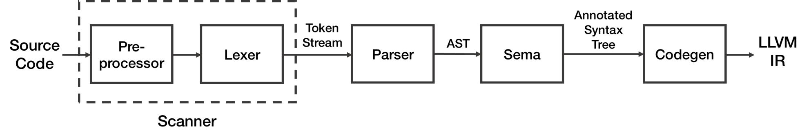

### 源码分析作业（第一次）

###### 学号：2020K8009926004

#### 声明：这一文档将被提交到一个公开仓库，出于隐私考虑，报告中不提及姓名。如有任何问题，欢迎和我邮件或QQ联系。

选题：LLVM中Clang部分的Lexer模块，该模块代码行数约为30k，主要使用的语言是C++，采用的是面向对象的程序设计。

选题原因：这学期选了编译原理课。希望把两门课的内容进行更好的结合。

#### 1. 主要功能、流程、模块

##### 1.1 LLVM

LLVM是一个开源的编译器基础设施项目，也是一个编译器和工具链技术的集合，其特点为模块化、可重用。可以用来开发任何编程语言的前端和任何指令集架构的后端。LLVM的设计中，为了达到模块化，它的核心实现是基于语言无关的中间表示（IR，一种可移植的高级汇编语言），这样，就可以通过多次遍历进行各种优化，而与更高级层面的高级语言以及更低级层面的机器架构都无关，从而让编译的大部分过程通用、可重用。

和很多其他编译器类似，LLVM的主要功能包括：

1. **进行语法检查**：LLVM可以进行语法检查，对于输入它的高级语言代码，检查不符合该语言语法规范的情况并视情况报出Warning或者Error。这样，一方面，程序员可以及时发现自己所编写的代码中存在的错误并加以改正；另一方面，也避免存在语法错误的代码进入后续的流程，导致编译器出错。
2. **编译高级代码为二进制**：这也是整个LLVM Pipeline的最重要的功能，也是编译器的最重要、最核心、最本质的功能。这一功能输入源代码，输出目标二进制代码。在所有相关功能中，编译高级代码为二进制，是从头到尾走完整个pipeline的。这也是编译器的意义之所在。
3. **对代码进行优化**：编译器会对代码进行优化。对于大多数代码，存在一些通用的优化方式，例如控制流简化、将复杂对象替换为标量、消除重复计算、优化全局变量、常量传播、死代码消除、循环优化、内联展开、指针分析等等。这些优化方式是在中间表示（IR）层面进行优化的，与具体指令集无关。而另有一些优化方式，它们对于具体的指令集是强相关的，例如RISC-V上的压缩指令集。

LLVM的主要流程如下：


其中，可以看到，LLVM的主要流程分为三段。第一段是前端，之后是中端和后端。

LLVM的前端负责生成抽象语法树（Abstract Syntax Tree, AST），并将之转换为原始的LLVM IR中间表示；中端负责将前端所输出的原始LLVM IR进行通用的优化，也即前面提到的在中间表示层面优化，并输出优化后的LLVM IR；而后端则负责输出转为机器指令后的原始代码。在一部分定义下，后端输出的是汇编代码，需要汇编器和链接器负责将它们转为目标二进制代码。但同样也有很多定义之下，汇编器和链接器也算在后端之中。下文中，为方便起见，采用后一种定义。

##### 1.2 Clang

Clang是LLVM项目中的一个原生前端模块。它支持的源语言（高级语言）包括C、Objective-C、C++。

Clang最早是由Apple资助开发的，用于开发一个更为通用的、在其自行开发的OS下表现更好的GNU编译器套装的替代品。这是因为Apple和GCC在当时存在分歧：Apple对Objective-C的自定义扩展得不到GCC的支持，且GCC的模块化程度太低，导致在只调用其中的少数模块时，十分不便。而GCC作为开源项目，也有着自己的苦衷。

因而，Apple资助开发了Clang。Clang在配合LLVM的情况下，相比GCC在编译C、Objective-C及C++的情况下，有着性能和功能上的巨大提升。一方面，它的编译用时降低到了GCC的不到50%，内存使用降低了近90%，且显示的错误诊断信息更为详细。

和其他的编译器前端十分类似，它可以进行语法错误检测，也可以完成整个前端工作，输出中间表示。

作为一个编译器前端，它也同样有着类似的流程，主要模块如下：



事实上，其中的每个模块，其内部结构都十分复杂，可以继续细分。但是，我们在此处不必把这些细分的结果写出来。

其中可以看到，Preprocessor负责处理预处理器指令，包括宏定义`#define`、条件编译`#ifdef`、导入头文件`#include`等。

Lexer则负责，和Preprocessor一道，把源代码转换为Token Stream。它们组成的是编译原理中的扫描器（Scanner），主要处理词法。值得注意的是，虽然上面的流程图里把Lexer放在Preprocessor的后面，但实际上，在Clang的实现中，是处理完一部分输入之后，Preprocessor调用下游的Lexer，然后重新回到Preprocessor继续处理输入流。

Parser则负责把Token Stream转换为AST。

然而，AST本身生成指令流的过程中，存在困难。这是因为，Parser是一个语法分析器，它负责的是把源代码每个部分之间的关系弄清楚（例如，3+5经过Parser处理后，会成为一棵树，其中，根节点为"某个运算符"，两个叶子节点为两个"某个整数"。），但是，他们具体代表什么，这并不清楚。

所以，我们需要Sema这个语义分析器。Sema生成带有语义注释的AST，具体理解每个节点上的意思。这样，刚才的3+5这个例子中，得到的树，根节点就变成了"一个运算符，其含义为把叶子节点相加"；两个叶子节点就变成了"一个整数，其值为3和"一个整数，其值为5"。

之后，Codegen模块就把带有语义注释的AST转为LLVM IR，作为整个模块的最终输出。


#### 2. 我选择的模块

我选择的模块是`Clang::Lexer`模块。

去掉方法的实现，其代码如下：

```c++
/// Lexer - This provides a simple interface that turns a text buffer into a
/// stream of tokens.  This provides no support for file reading or buffering,
/// or buffering/seeking of tokens, only forward lexing is supported.  It relies
/// on the specified Preprocessor object to handle preprocessor directives, etc.
class Lexer : public PreprocessorLexer {
  virtual void anchor();

  //===--------------------------------------------------------------------===//
  // Constant configuration values for this lexer.
  const char *BufferStart;       // Start of the buffer.
  const char *BufferEnd;         // End of the buffer.
  SourceLocation FileLoc;        // Location for start of file.
  LangOptions LangOpts;          // LangOpts enabled by this language (cache).
  bool Is_PragmaLexer;           // True if lexer for _Pragma handling.
  
  //===--------------------------------------------------------------------===//
  // Context-specific lexing flags set by the preprocessor.
  //

  /// ExtendedTokenMode - The lexer can optionally keep comments and whitespace
  /// and return them as tokens.  This is used for -C and -CC modes, and
  /// whitespace preservation can be useful for some clients that want to lex
  /// the file in raw mode and get every character from the file.
  ///
  /// When this is set to 2 it returns comments and whitespace.  When set to 1
  /// it returns comments, when it is set to 0 it returns normal tokens only.
  unsigned char ExtendedTokenMode;

  //===--------------------------------------------------------------------===//
  // Context that changes as the file is lexed.
  // NOTE: any state that mutates when in raw mode must have save/restore code
  // in Lexer::isNextPPTokenLParen.

  // BufferPtr - Current pointer into the buffer.  This is the next character
  // to be lexed.
  const char *BufferPtr;

  // IsAtStartOfLine - True if the next lexed token should get the "start of
  // line" flag set on it.
  bool IsAtStartOfLine;

  // CurrentConflictMarkerState - The kind of conflict marker we are handling.
  ConflictMarkerKind CurrentConflictMarkerState;

  Lexer(const Lexer &) LLVM_DELETED_FUNCTION;
  void operator=(const Lexer &) LLVM_DELETED_FUNCTION;
  friend class Preprocessor;
}
```

它继承于 `Clang::PreprocessorLexer`：

```c++
class PreprocessorLexer {
  virtual void anchor();
protected:
  Preprocessor *PP;              // Preprocessor object controlling lexing.

  /// The SourceManager FileID corresponding to the file being lexed.
  const FileID FID;

  /// \brief Number of SLocEntries before lexing the file.
  unsigned InitialNumSLocEntries;

  //===--------------------------------------------------------------------===//
  // Context-specific lexing flags set by the preprocessor.
  //===--------------------------------------------------------------------===//

  /// \brief True when parsing \#XXX; turns '\\n' into a tok::eod token.
  bool ParsingPreprocessorDirective;

  /// \brief True after \#include; turns \<xx> into a tok::angle_string_literal
  /// token.
  bool ParsingFilename;

  /// \brief True if in raw mode.
  ///
  /// Raw mode disables interpretation of tokens and is a far faster mode to
  /// lex in than non-raw-mode.  This flag:
  ///  1. If EOF of the current lexer is found, the include stack isn't popped.
  ///  2. Identifier information is not looked up for identifier tokens.  As an
  ///     effect of this, implicit macro expansion is naturally disabled.
  ///  3. "#" tokens at the start of a line are treated as normal tokens, not
  ///     implicitly transformed by the lexer.
  ///  4. All diagnostic messages are disabled.
  ///  5. No callbacks are made into the preprocessor.
  ///
  /// Note that in raw mode that the PP pointer may be null.
  bool LexingRawMode;

  /// \brief A state machine that detects the \#ifndef-wrapping a file
  /// idiom for the multiple-include optimization.
  MultipleIncludeOpt MIOpt;

  /// \brief Information about the set of \#if/\#ifdef/\#ifndef blocks
  /// we are currently in.
  SmallVector<PPConditionalInfo, 4> ConditionalStack;

  PreprocessorLexer(const PreprocessorLexer &) LLVM_DELETED_FUNCTION;
  void operator=(const PreprocessorLexer &) LLVM_DELETED_FUNCTION;
  friend class Preprocessor;
}
```

可以看到，它们和Preprocessor都是friend class，能够让Preprocessor调用Private方法。

Lexer的主要调用方法，除了Constructor之外，则是：

```c++
  /// Lex - Return the next token in the file.  If this is the end of file, it
  /// return the tok::eof token.  This implicitly involves the preprocessor.
  bool Lex(Token &Result);

  /// LexTokenInternal - Internal interface to lex a preprocessing token. Called
  /// by Lex.
  bool LexTokenInternal(Token &Result, bool TokAtPhysicalStartOfLine);
```

这两个方法。

使用Lexer时，将不可避免地以上面两个方法作为最主要的接口。

它们还将调用Lexer中大量的Helper Methods进行处理，包括但不限于：

```c++
void FormTokenWithChars(Token &Result, const char *TokEnd, tok::TokenKind Kind);
static bool isObviouslySimpleCharacter(char C);
inline char getAndAdvanceChar(const char *&Ptr, Token &Tok);
const char *ConsumeChar(const char *Ptr, unsigned Size, Token &Tok);
inline char getCharAndSize(const char *Ptr, unsigned &Size);
static unsigned getEscapedNewLineSize(const char *P);
static const char *SkipEscapedNewLines(const char *P);
static SizedChar getCharAndSizeSlowNoWarn(const char *Ptr, const LangOptions &LangOpts);
bool LexIdentifierContinue(Token &Result, const char *CurPtr);
bool LexNumericConstant    (Token &Result, const char *CurPtr);
bool LexStringLiteral      (Token &Result, const char *CurPtr, tok::TokenKind Kind);
bool LexRawStringLiteral   (Token &Result, const char *CurPtr, tok::TokenKind Kind);
bool LexAngledStringLiteral(Token &Result, const char *CurPtr);
bool LexCharConstant       (Token &Result, const char *CurPtr, tok::TokenKind Kind);
bool LexEndOfFile          (Token &Result, const char *CurPtr);
bool SkipWhitespace        (Token &Result, const char *CurPtr, bool &TokAtPhysicalStartOfLine);
bool SkipLineComment       (Token &Result, const char *CurPtr, bool &TokAtPhysicalStartOfLine);
bool SkipBlockComment      (Token &Result, const char *CurPtr, bool &TokAtPhysicalStartOfLine);
bool SaveLineComment       (Token &Result, const char *CurPtr);
bool IsStartOfConflictMarker(const char *CurPtr);
bool HandleEndOfConflictMarker(const char *CurPtr);
bool lexEditorPlaceholder(Token &Result, const char *CurPtr);
bool isCodeCompletionPoint(const char *CurPtr) const;
void cutOffLexing() { BufferPtr = BufferEnd; }
bool isHexaLiteral(const char *Start, const LangOptions &LangOpts);
void codeCompleteIncludedFile(const char *PathStart,  const char *CompletionPoint, bool IsAngled);
```

具体的功能建模分析及主要的流程分析，将在第二次作业中进一步体现。
