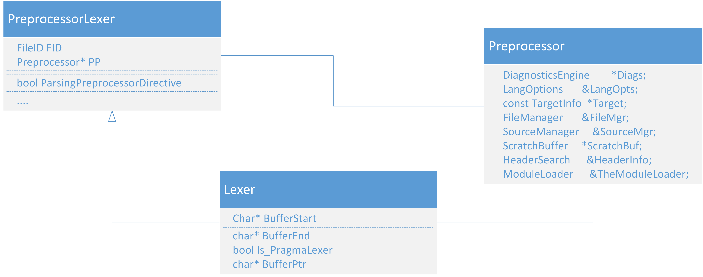
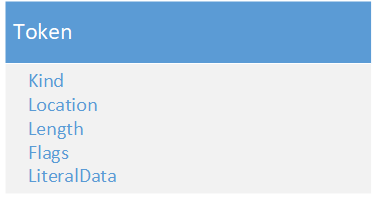

### 源码分析作业（第2次）

###### 学号：2020K8009926004

#### 声明：这一文档将被提交到一个公开仓库，出于隐私考虑，报告中不提及姓名。如有任何问题，欢迎和我邮件或QQ联系。

模块：LLVM->Clang->词法分析器

### 核心流程设计和分析

#### 1. 类间关系

由于Clang的词法分析器十分复杂，因此只选择一部分特别重要的类画出UML图。

在Clang中，`Lexer`、`PreprocessorLexer`和`Preprocessor`是三个相关的组件，用于C++源代码的词法分析和预处理。

`Lexer`是Clang的词法分析器，负责将源代码拆分成令牌（tokens），并提供给语法分析器进行进一步处理。它处理诸如标识符、关键字、运算符、常量等词法单元，并生成对应的词法令牌。

`PreprocessorLexer`是一个包装器，它添加了封装后的预处理功能，并进一步打包。在`PreprocessorLexer`中，源代码首先经过预处理器的处理，包括宏展开、条件编译等。然后，`PreprocessorLexer`将预处理后的代码传递给`Lexer`进行词法分析。

`Preprocessor`是Clang的预处理器，它是源代码的第一阶段处理器。它负责处理诸如宏定义、条件编译指令、包含文件等预处理指令。`Preprocessor`在词法分析之前将源代码转换为预处理后的代码，然后将其传递回`PreprocessorLexer`进行进一步的词法分析。

因此，代码的处理Pipeline如下（调用关系则是反过来）：
源代码 -> `Preprocessor` -> 预处理后的代码 -> `PreprocessorLexer` -> 词法分析 -> `Lexer`

画出UML图亦如下所示：



通过这三者之间的Pipeline，将源代码转换为Token，放入Token Stream中。当然，对于具体的部分，还会调用大量的外部类和方法进行针对性的处理。这些类过于繁多、杂乱且不具有代表性，因此不在此展开。

Token类也是一个重要的类。它是词法分析器输出的数据结构，是一个表示源代码中的最小语法单位的对象，它包含以下成员：

- Kind：一个Enumerate类型，表示Token的种类，例如标识符、关键字、字面量、运算符、标点符号等。
- Location：一个SourceLocation类型，表示Token在源代码中的位置，包括文件名、行号、列号等信息。
- Length：一个unsigned int类型，表示Token的长度，即Token占用的字符数。
- Flags：是很多flags的集合，例如：是否是宏展开、是否是注释、是否是空白等。
- LiteralData：一个指针类型，表示Token的字面值，例如字符串、数字、字符等。这个字段只有在Token是字面量时才有效。

画出的UML类图如下：



#### 2. 核心流程

为更好地描述语法分析器的实现流程，以处理一个`#pragma`编译器制导为例：

`Lexer::LexTokenInternal() `函数根据当前输入缓冲区中的字符进行识别。

这里有一个Switch-Case语句，包含了几乎所有的字符。此处以遇到`#`为例：

```c++
void Lexer::LexTokenInternal(Token &Result) {
LexNextToken:
  // New token, can't need cleaning yet.
  Result.clearFlag(Token::NeedsCleaning);
  Result.setIdentifierInfo(0);

  // CurPtr - Cache BufferPtr in an automatic variable.
  const char *CurPtr = BufferPtr;

  // Small amounts of horizontal whitespace is very common between tokens.
  if ((*CurPtr == ' ') || (*CurPtr == '\t')) {
    ++CurPtr;
    while ((*CurPtr == ' ') || (*CurPtr == '\t'))
      ++CurPtr;

    // If we are keeping whitespace and other tokens, just return what we just
    // skipped.  The next lexer invocation will return the token after the
    // whitespace.
    if (isKeepWhitespaceMode()) {
      FormTokenWithChars(Result, CurPtr, tok::unknown);
      // FIXME: The next token will not have LeadingSpace set.
      return;
    }

    BufferPtr = CurPtr;
    Result.setFlag(Token::LeadingSpace);
  }
  unsigned SizeTmp, SizeTmp2;   // Temporaries for use in cases below.

  // Read a character, advancing over it.
  char Char = getAndAdvanceChar(CurPtr, Result);
  tok::TokenKind Kind;

  switch (Char) {
          ....
  case '#':
    Char = getCharAndSize(CurPtr, SizeTmp);
    if (Char == '#') {
      Kind = tok::hashhash;
      CurPtr = ConsumeChar(CurPtr, SizeTmp, Result);
    } else if (Char == '@' && LangOpts.MicrosoftExt) {  // #@ -> Charize
      Kind = tok::hashat;
      if (!isLexingRawMode())
        Diag(BufferPtr, diag::ext_charize_microsoft);
      CurPtr = ConsumeChar(CurPtr, SizeTmp, Result);
    } else {
      // We parsed a # character.  If this occurs at the start of the line,
      // it's actually the start of a preprocessing directive.  Callback to
      // the preprocessor to handle it.
      // FIXME: -fpreprocessed mode??
      if (Result.isAtStartOfLine() && !LexingRawMode && !Is_PragmaLexer)
        goto HandleDirective;

      Kind = tok::hash;
    }
    break;
		....
   // Notify MIOpt that we read a non-whitespace/non-comment token.
  MIOpt.ReadToken();

  // Update the location of token as well as BufferPtr.
  FormTokenWithChars(Result, CurPtr, Kind);
  return;

HandleDirective:
  // We parsed a # character and it's the start of a preprocessing directive.

  FormTokenWithChars(Result, CurPtr, tok::hash);
  PP->HandleDirective(Result);

  // As an optimization, if the preprocessor didn't switch lexers, tail
  // recurse.
  if (PP->isCurrentLexer(this)) {
    // Start a new token.  If this is a #include or something, the PP may
    // want us starting at the beginning of the line again.  If so, set
    // the StartOfLine flag and clear LeadingSpace.
    if (IsAtStartOfLine) {
      Result.setFlag(Token::StartOfLine);
      Result.clearFlag(Token::LeadingSpace);
      IsAtStartOfLine = false;
    }
    goto LexNextToken;   // GCC isn't tail call eliminating.
  }
  return PP->Lex(Result);
```

它会调用`Preprocessor::HandleDirective()`进行下一步处理。

然后`Preprocessor::HandleDirective()`调用类`PragmaNamespace` 实例 `PragmaHandlers` 的 `HandlePragma` 方法进行下一步处理：

```c++
void Preprocessor::HandleDirective(Token &Result) {
  // We just parsed a # character at the start of a line, so we're in directive
  // mode.  Tell the lexer this so any newlines we see will be converted into an
  // EOD token (which terminates the directive).
  CurPPLexer->ParsingPreprocessorDirective = true;
  if (CurLexer) CurLexer->SetKeepWhitespaceMode(false);

  ++NumDirectives;

  // We are about to read a token.  For the multiple-include optimization FA to
  // work, we have to remember if we had read any tokens *before* this
  // pp-directive.
  bool ReadAnyTokensBeforeDirective =CurPPLexer->MIOpt.getHasReadAnyTokensVal();

  // Save the '#' token in case we need to return it later.
  Token SavedHash = Result;

  // Read the next token, the directive flavor.  This isn't expanded due to
  // C99 6.10.3p8.
  LexUnexpandedToken(Result);

  // Temporarily enable macro expansion if set so
  // and reset to previous state when returning from this function.
  ResetMacroExpansionHelper helper(this);

  switch (Result.getKind()) {
  case tok::eod:
    return;   // null directive.
  case tok::code_completion:
    if (CodeComplete)
      CodeComplete->CodeCompleteDirective(
                                    CurPPLexer->getConditionalStackDepth() > 0);
    setCodeCompletionReached();
    return;
  case tok::numeric_constant:  // # 7  GNU line marker directive.
    if (getLangOpts().AsmPreprocessor)
      break;  // # 4 is not a preprocessor directive in .S files.
    return HandleDigitDirective(Result);
  default:
    IdentifierInfo *II = Result.getIdentifierInfo();
    if (II == 0) break;  // Not an identifier.

    // Ask what the preprocessor keyword ID is.
    switch (II->getPPKeywordID()) {
            ....
    
    // C99 6.10.6 - Pragma Directive.
    case tok::pp_pragma:
      return HandlePragmaDirective(PIK_HashPragma);
    ....       
    }
          
  }
  // If this is a .S file, treat unknown # directives as non-preprocessor
  // directives.  This is important because # may be a comment or introduce
  // various pseudo-ops.  Just return the # token and push back the following
  // token to be lexed next time.
  if (getLangOpts().AsmPreprocessor) {
    Token *Toks = new Token[2];
    // Return the # and the token after it.
    Toks[0] = SavedHash;
    Toks[1] = Result;
    
    // If the second token is a hashhash token, then we need to translate it to
    // unknown so the token lexer doesn't try to perform token pasting.
    if (Result.is(tok::hashhash))
      Toks[1].setKind(tok::unknown);
    
    // Enter this token stream so that we re-lex the tokens.  Make sure to
    // enable macro expansion, in case the token after the # is an identifier
    // that is expanded.
    EnterTokenStream(Toks, 2, false, true);
    return;
  }

  // If we reached here, the preprocessing token is not valid!
  Diag(Result, diag::err_pp_invalid_directive);

  // Read the rest of the PP line.
  DiscardUntilEndOfDirective();

  // Okay, we're done parsing the directive.
}    
```

注意到，这里同样使用了一个Switch-Case语句判断使用哪个directive进行处理。

之后，进入`HandlePragmaDirective`，代码如下：

```c
void Preprocessor::HandlePragmaDirective(unsigned Introducer) {
  if (!PragmasEnabled)
    return;

  ++NumPragma;

  // Invoke the first level of pragma handlers which reads the namespace id.
  Token Tok;
  PragmaHandlers->HandlePragma(*this, PragmaIntroducerKind(Introducer), Tok);

  // If the pragma handler didn't read the rest of the line, consume it now.
  if ((CurTokenLexer && CurTokenLexer->isParsingPreprocessorDirective()) 
   || (CurPPLexer && CurPPLexer->ParsingPreprocessorDirective))
    DiscardUntilEndOfDirective();
}
```

这里，调用注册了的Pragma Handler的对应方法进行对应Pragma的处理。

一个例子是：

```c++
void Parser::HandlePragmaUnused() {
  assert(Tok.is(tok::annot_pragma_unused));
  SourceLocation UnusedLoc = ConsumeToken();
  Actions.ActOnPragmaUnused(Tok, getCurScope(), UnusedLoc);
  ConsumeToken(); // The argument token.
}
```

它处理`#pragma unused`，包括检查格式、生成Token两部分。

然后，Token被返回。

Lexer最后一行`return PP->Lex(Result);`调用`Preprocessor::Lex()`函数将 Token 流中注解的 Token 取出并装载进 `Parser::Tok` 中。

```c++
  /// Lex - To lex a token from the preprocessor, just pull a token from the
  /// current lexer or macro object.
  void Lex(Token &Result) {
    switch (CurLexerKind) {
    case CLK_Lexer: CurLexer->Lex(Result); break;
    case CLK_PTHLexer: CurPTHLexer->Lex(Result); break;
    case CLK_TokenLexer: CurTokenLexer->Lex(Result); break;
    case CLK_CachingLexer: CachingLex(Result); break;
    case CLK_LexAfterModuleImport: LexAfterModuleImport(Result); break;
    }
  }
```

#### 3. 顺序图

以下是简化后的顺序图，忽略了一些不相干的或不重要的操作：


