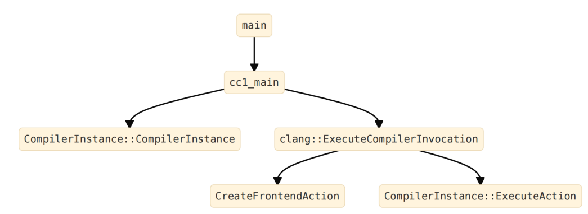
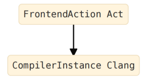
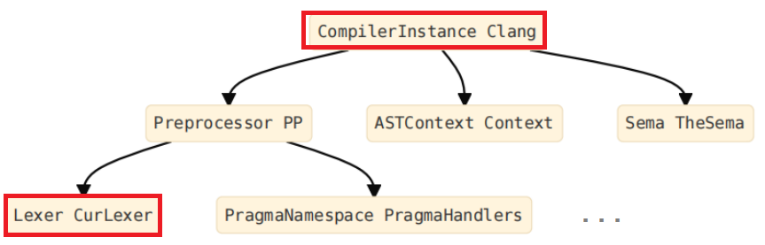
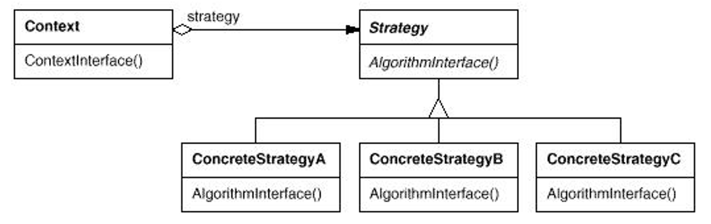

### 源码分析作业（第3次）

###### 学号：2020K8009926004

#### 声明：这一文档将被提交到一个公开仓库，出于隐私考虑，报告中不提及姓名。如有任何问题，欢迎和我邮件或QQ联系。

模块：LLVM->Clang->词法分析器

### 高级设计意图

注：由于Clang中对Lexer的实现较为复杂，因此在对Lexer的分析过程中，将不可避免地涉及到很多其他模块和其他类，例如Preprocessor等。

#### 1. 单例模式（Singleton Pattern）

单例模式是一种设计模式。在单例模式设计思想的指导之下，一个类只有一个实例，并提供了一个全局访问点。同时，单例模式尽量避免频繁创建和销毁对象，减少在此过程中的开销。

使用单例模式的优势在于：

- **节省资源**：由于只创建了一个实例，所以可以减少创建和销毁的开销，以及同时存在多个重复实例时，占用内存的开销。
- **保证一致性**：由于所有的访问都是通过同一个实例，所以可以确保数据和行为的一致性。
- **方便管理**：由于只有一个实例，所以可以方便地对其进行管理和维护。

Clang的词法分析器（Lexer）由一个名为`CompilerInstance`的对象进行创建并调用。`CompilerInstance`类是Clang的核心类之一，表示编译器实例，用于管理和执行单个编译任务。它负责设置编译过程中的各种选项和配置，并提供了对编译过程中的各个阶段进行控制和访问的接口。在一个编译任务中，通常只会创建一个`CompilerInstance`对象实例，创建的位置通常会在编译器的入口函数，并在整个编译过程中被传递和使用。

具体的类间关系如下：



可以看到，事实上，`CompilerInstance`实例是由Main函数所创建的。

具体地，其中的变量间关系如下：



可以看到，Clang就是具体的实例名称。

`CompilerInstance`类到Lexer之间的调用过程比较复杂，但是其本质上，就是`CompilerInstance`先调用Preprocessor类，然后Preprocessor类和Lexer类互相调用（此处只体现第一次调用，之后的互相调用未画出）：



另有一个特别的例子是，在Clang的命令行工具`clang`中，通常会创建一个`CompilerInstance`对象实例，来代表整个编译过程。

Clang中，只使用单一的`CompilerInstance`实例，好处是可以节省资源，对于所有的源文件，采用同一个管理器；同时，也保证了编译过程中的一致性，方便编译中，跨源文件引用等操作。

#### 2. 策略模式（Strategy Pattern）

策略模式是一种行为型设计模式，它定义了一系列的算法，并将每一个算法封装起来，使它们可以相互替换，且不影响客户端的使用。策略模式的目的是让算法的变化不影响到使用算法的客户端，也就是实现算法和客户端的解耦。

策略模式的主要角色有以下三个：

- **策略（Strategy）**：定义了一个公共接口，不同的算法以不同的方式实现这个接口，环境角色使用这个接口调用不同的算法。
- **具体策略（Concrete Strategy）**：实现了策略接口的具体算法类，封装了各种实现算法的逻辑。
- **环境（Context）**：它持有一个策略类的引用，提供给客户端使用。可以通过constructor或者 setter 方法来接收不同的策略对象，然后根据不同的策略对象来执行不同的业务逻辑。

策略模式的优点有：

- 可以提供多种可替换的算法，增加了系统的灵活性和可扩展性。
- 避免多重条件选择语句，提高了代码的可读性和维护性。
- 实现算法和实例的分离，减少调用的复杂关系。

具体来说，策略模式可以画出如下的图：



Clang的词法分析器中，很多位置都使用了策略模式。

这里以【处理`#pragma`，把`#pragma`转变为语义层面的动作】这一过程为例：

这一过程的核心代码实现如下：

```c++
void PragmaNamespace::HandlePragma(Preprocessor &PP, 
                                   PragmaIntroducerKind Introducer,
                                   Token &Tok) {
  // Read the 'namespace' that the directive is in, e.g. STDC.  Do not macro
  // expand it, the user can have a STDC #define, that should not affect this.
  PP.LexUnexpandedToken(Tok);

  // Get the handler for this token.  If there is no handler, ignore the pragma.
  PragmaHandler *Handler
    = FindHandler(Tok.getIdentifierInfo() ? Tok.getIdentifierInfo()->getName()
                                          : StringRef(),
                  /*IgnoreNull=*/false);
  if (Handler == 0) {
    PP.Diag(Tok, diag::warn_pragma_ignored);
    return;
  }

  // Otherwise, pass it down.
  Handler->HandlePragma(PP, Introducer, Tok);
}
```

此处，Strategy的抽象接口就是`Handler->HandlePragma()`。Context的获取通过`Tok.getIdentifierInfo()`来完成。而由Context获取到的Concrete Strategy，则是一个引用，也就是获取到的`Handler`指针所指向的对象。

例如，对于`#pragma openmp`，所引用到的`Handler`为一个`class PragmaOpenMPHandler`的实例（此处使用的namespace是`clang`）。其类定义为：

```c++
class PragmaOpenMPHandler : public PragmaHandler {
public:
  PragmaOpenMPHandler() : PragmaHandler("omp") { }
  virtual void HandlePragma(Preprocessor &PP, PragmaIntroducerKind Introducer,
                            Token &FirstToken);
};
```

其对于接口的实现为：

```c++
void PragmaOpenMPHandler::HandlePragma(Preprocessor &PP,
                                       PragmaIntroducerKind Introducer,
                                       Token &FirstTok) {
  SmallVector<Token, 16> Pragma;
  Token Tok;
  Tok.startToken();
  Tok.setKind(tok::annot_pragma_openmp);
  Tok.setLocation(FirstTok.getLocation());

  while (Tok.isNot(tok::eod)) {
    Pragma.push_back(Tok);
    PP.Lex(Tok);
  }
  SourceLocation EodLoc = Tok.getLocation();
  Tok.startToken();
  Tok.setKind(tok::annot_pragma_openmp_end);
  Tok.setLocation(EodLoc);
  Pragma.push_back(Tok);

  Token *Toks = new Token[Pragma.size()];
  std::copy(Pragma.begin(), Pragma.end(), Toks);
  PP.EnterTokenStream(Toks, Pragma.size(),
                      /*DisableMacroExpansion=*/true, /*OwnsTokens=*/true);
}
```

所实现的抽象接口，由于返回值为void类型（即：无需返回），因此甚至body部分没有代码：

```c++
void EmptyPragmaHandler::HandlePragma(Preprocessor &PP, 
                                      PragmaIntroducerKind Introducer,
                                      Token &FirstToken) {}
```


#### 3. 享元模式（Flyweight）

享元模式可以减少对象的创建和内存占用，提高程序的性能和效率。享元模式的核心思想是将对象的共享属性（内部状态）和独立属性（外部状态）分离，然后通过通过管理和复用这些共享对象，避免非必要的对象创建。

享元模式的优点有：

- 节省内存空间，减少对象的数量，提高程序的运行速度。
- 降低了系统的复杂度，方便了对象的管理和维护。

享元模式的应用场景有：

- 存在大量相似的对象，而这些对象的创建和销毁会消耗大量的资源时，使用享元模式，节约大量资源。
- 需要缓存一些对象，以便于快速访问和重用，此时享元模式可以做到有效地缓存。
- 需要使用大量的枚举、常量、配置等数据时，享元模式将把它们统一。这样避免了重复所带来的额外开销，也避免把相同的内容识别为不同内容。

Clang的词法分析阶段，使用了大量享元模式的思想。

一个例子是，Clang对于`#include`的部分，支持预编译头文件（PCH），这就是享元模式的一个例子。此时，负责管理和复用它的，就是抽象的PCH相关处理机制，以及头文件管理机制。

而对于词法分析，也有Pretokenized Header机制，也即PTH机制。

一个使用PTH的命令行例子是：

```bash
$ clang -cc1 -include-pth pretokenized.h.pth example.c 
```

其具体处理依靠`class PTHManager`进行处理。在`CompilerInstance`创建Preprocessor实例时即生成`PTHManager`的实例。

```c++
  PTHManager *PTHMgr = 0;
  if (!PPOpts.TokenCache.empty())
    PTHMgr = PTHManager::Create(PPOpts.TokenCache, getDiagnostics());
```

并在Preprocessor中注册`PTHMgr`：

```c++
  if (PTHMgr) {
    PTHMgr->setPreprocessor(&*PP);
    PP->setPTHManager(PTHMgr);
  }
```

